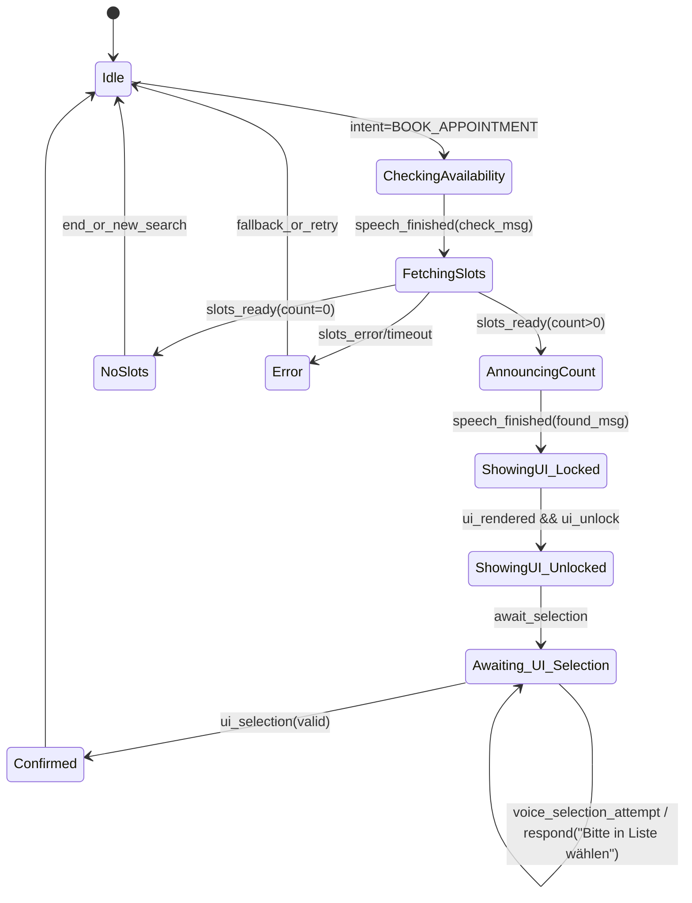
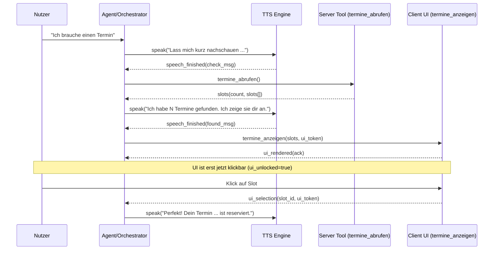

# UI-Interaktionen bei Terminbuchung mit Voice-Agents, die die UI zur Laufzeit verändern  

## Executive Summary  

Viele Organisationen lösen das Problem „UI erscheint zu früh“ (z. B. bevor TTS fertig ist) und das Sicherheits-/UX-Thema „Auswahl nur via UI“ nicht primär durch Prompting, sondern durch **harte Interaktions-Contracts** zwischen Agent, Orchestrator und Client-UI: **(a)** Zustandsmaschine mit klaren Commit-Punkten, **(b)** Event-Sequencing (Sprechen → Tool → Sprechen → UI), **(c)** UI-Locking/Disablement bis ein explizites Freigabe-Event eintrifft, und **(d)** ausschließlich **strukturierte UI-Events** (Buttons/Submit/Invoke) als „Source of Truth“ für Auswahl/Bestätigung. Diese Muster sind in großen Plattformen sichtbar:  
Microsoft setzt in Teams/Adaptive Cards darauf, dass Eingaben erst beim **Submit** an den Bot gehen; vorherige Feldänderungen zählen nicht als Input. citeturn14view0 In Copilot Studio sind interaktive Adaptive Cards explizit darauf ausgelegt, dass der Agent **auf eine Card-Submission wartet** und Textnachrichten währenddessen als „invalid“ behandeln und reprompten kann. citeturn13view0 Copilot Studio unterstützt zudem **Event Activities** und sogar **Client Tools**, bei denen der Agent ein Event an den Client sendet, **wartet**, bis der Client die Aktion ausführt, und dann ein Ergebnis-Event zurückbekommt—ein ideales Fundament für „Agent verändert UI zur Laufzeit“ mit sauberem Handshake. citeturn12view0  

In Banken und regulierten Umfeldern sieht man zusätzlich: **Voice und UI werden getrennt** („Voice ist erklärend, UI ist transaktional“), mit expliziten Bestätigungsschritten und Telemetrie. Microsoft zeigt das u. a. in Fallstudien zu **Rabobank** (Chat + Voice mit Azure Speech + Copilot Studio) und **ABN AMRO** (Text + IVR), inklusive Monitoring/Analyse (Power BI, Application Insights). citeturn16view0turn17view0 Im Healthcare-Kontext nutzt Microsofts Healthcare Agent Service/Health Bot ebenfalls Karten/Adaptive Cards und demonstriert Scheduling-Integrationen über Microsoft Bookings. citeturn19view0turn18view0  

Für eure konkrete Anforderung (UI erst nach TTS-Ende; UI-only Auswahl) ist die robusteste Architektur: **UI-Rendering wird erst durch ein „UI_UNLOCK“-Signal freigegeben**, das entweder (1) vom Orchestrator nach bestätigtem TTS-Ende gesendet wird oder (2) vom Client nach TTS-Ende aus einem gepufferten Event ausgelöst wird. TTS-Ende wird zuverlässig über **Speech-End-Events** (Web Speech API `end`) oder Speech-SDK Completion-Events abgebildet. citeturn1search10turn5search13turn0search1  

## Was erfolgreiche Agent-UI-Interaktionen auszeichnet  

Ein hilfreicher Bezugsrahmen ist die Trennung in drei Ebenen:  

**Interaktions-Vertrag (Contract)**  
Der Agent darf UI-Änderungen nur als **wohl-definierte Commands/Events** anfordern („zeige Terminliste“, „lock/unlock UI“, „markiere Auswahl“), und der Client bestätigt Ausführung/Resultat. Dieses Modell ist in Copilot Studio explizit beschrieben: Event Activities werden vom Agent gesendet, können im Kanal abgefangen werden, und bei „Client Tools“ wartet der Agent auf das Resultat-Event vom Client, bevor die Orchestrierung fortgesetzt wird. citeturn12view0  

**Zustandsorientierung statt Prompt-Sequencing**  
Prompt-Schritte allein reichen nicht, weil TTS, Netzwerktools und UI parallel laufen. Erfolgreiche Systeme halten deshalb einen **expliziten Zustand** (z. B. `FETCHING_SLOTS`, `ANNOUNCING_COUNT`, `UI_LOCKED`, `AWAITING_UI_SELECTION`) und akzeptieren Eingaben nur, wenn sie zum Zustand passen. Copilot Studio unterstützt diese Logik „out of the box“ bei Cards: interaktive Cards pausieren den Flow bis zur Submission, inklusive definierbarer Wiederholungen/Invalid-Handling. citeturn13view0  

**Commit-Punkt = strukturierter UI-Event**  
Plattformen wie Microsoft Teams machen deutlich: Der Bot „bekommt“ Nutzereingaben erst, wenn der Nutzer **Submit/Save** klickt—das ist ein natürlicher Commit-Punkt. citeturn14view0 Dasselbe Prinzip nutzen Adaptive Cards allgemein (Action.Submit sammelt Inputs + optional „hidden data“ und sendet ein Event). citeturn0search8turn14view0  

## Muster und Best Practices zur Vermeidung von „UI zu früh“ und zur UI-only Auswahl  

Die folgenden Muster sind in großen Plattformen und Produktionssystemen am häufigsten, weil sie deterministisch und testbar sind.

### Vergleichstabelle: Muster vs. Vor- und Nachteile  

| Muster | Kurzbeschreibung | Vorteile | Nachteile / Risiken | Gut geeignet, wenn… |
|---|---|---|---|---|
| Hard Gate: „UI erst nach `speech_finished`“ | UI wird erst gerendert/angezeigt, nachdem TTS-Ende bestätigt ist (z. B. über `end`-Event). citeturn1search10turn5search13 | Maximale Klarheit; vermeidet Race Conditions vollständig; sehr gut testbar | Kann „langsamer“ wirken; benötigt zuverlässiges TTS-Ende-Signal | Nutzer sonst früh klicken (Fehlbedienung), besonders bei Terminlisten |
| Soft Gate: UI sichtbar, aber „locked/disabled“ | UI erscheint früh, ist aber bis Freigabe nicht klickbar (Overlay + ARIA Status). WCAG-konform über Status Messages möglich. citeturn6search3turn6search11 | Wirkt schnell; reduziert gefühlte Latenz; kann Skeleton/Preview zeigen | Nutzer kann trotzdem verwirrt sein („warum nicht klickbar?“); braucht gutes Copy/Feedback | Wenn „Perceived Performance“ wichtig ist |
| Two-Phase UI Commit | Phase 1: Anzeige/Optionen; Phase 2: expliziter Commit (Submit/Confirm). Teams/Adaptive Cards sind so gebaut. citeturn14view0turn0search8 | Verhindert Fehler, entspricht „Error Prevention“ bei wichtigen Vorgängen. citeturn6search0 | Zusätzlicher Klick/Schritt; braucht gute UX | Wenn Buchung/Reservierung „wichtig“ ist (Bank/Healthcare) |
| UI-only Selection Enforcement | Nur UI-Events sind gültig; Voice/Text-Auswahl wird immer zurückgewiesen; Copilot Studio kann Text als invalid werten, wenn Card-Submission erwartet wird. citeturn13view0 | Eliminates Ambiguity; verhindert „voice override“; robuste Sicherheit | Muss konsequent implementiert werden (Client + Agent + Backend) | Wenn ihr regulatorisch/operativ kein Risiko wollt |
| „Unique Card/Request IDs“ | Jede Liste/Card enthält eindeutige IDs; nur Selection mit gleichlautender ID ist akzeptiert; Copilot Studio empfiehlt Isolierung/Eindeutigkeit bei Submit-Actions. citeturn13view0turn14view0 | Schützt vor Stale Clicks/Doppelklick; verhindert alte Aktionen | Mehr Aufwand; erfordert Token/ID-Management | Bei aufeinanderfolgenden Cards/Listen, schnellen Nutzern |
| Disable „stale UI“ (z. B. alte Cards) | Frühere UI-Elemente werden nach neuem Zustand deaktiviert; WebChat-Sample zeigt „disabled={!recentBotMessage}“. citeturn3search3 | Verhindert späte Klicks auf alte Optionen; reduziert Doppelsubmits | Muss barrierefrei umgesetzt werden; Nutzer braucht Hinweis | Wenn Nutzer zurückscrollen/alte Listen anklicken |
| Client-Tool Handshake (Event → Ack/Result) | Agent sendet Event zum Client, wartet auf Ergebnis-Event (Client Tool Pattern in Copilot Studio). citeturn12view0 | Höchste Kontrolle; sauberer Orchestrierungs-Punkt; ideal für UI-Manipulation zur Laufzeit | Implementationsaufwand; erfordert robustes Event-Routing | Wenn UI außerhalb des Chatfensters verändert wird (Website/Portal) |

### Schlüssel-Best-Practices, die bei Microsoft besonders klar sind  

**„UI-Aktion = Event mit Payload“**: In Teams sendet `Action.Submit` die Inputs + hidden data als Aktivität an den Bot. citeturn14view0 Das erlaubt euch, Termin-IDs als hidden payload zu führen (kein Parsing von Text/Voice nötig).  

**„Input zählt erst bei Submit“**: Teams weist explizit darauf hin, dass der Bot keine Inputs „bekommt“, nur weil jemand Felder selektiert—erst der Submit-Button zählt. citeturn14view0  

**„Invalid Response Handling“**: Copilot Studio beschreibt explizit, dass Textnachrichten als „invalid“ gelten können, wenn der Agent auf Card-Submission wartet, inkl. konfigurierbarer Reprompts. citeturn13view0  

**„Concurrency/Timeout Awareness“**: Teams dokumentiert typische Fehlerursachen beim Form-Submit (u. a. „multiple concurrent operations“ oder „Gateway Timeout“), was indirekt begründet, warum UI-Locking (nur eine aktive Operation) wichtig ist. citeturn14view0  

## Plattform- und Branchenbeispiele  

### Vergleichstabelle: Vendor-/Plattform-Beispiele und Mechanismen (mit Quellen)  

| Plattform / Produkt | Mechanismus für „Agent verändert UI zur Laufzeit“ | Mechanismus für „UI-only Auswahl/Commit“ | Hinweise zur Vermeidung von „zu früh“ |
|---|---|---|---|
| **Microsoft Copilot Studio** (Web/Custom Canvas) | Event Activities + „Client Tools“: Agent sendet Event mit Inputs, wartet auf Result-Event vom Client. citeturn12view0 | „Ask with Adaptive Card“: Agent wartet auf Submit; Text kann als invalid behandelt und reprompted werden. citeturn13view0 | Ideal: Client puffert „show UI“-Event bis `speech_finished`, oder Orchestrator sendet „UI unlock“ erst nach TTS-Ende (siehe Implementationsabschnitt). |
| **Microsoft Teams + Adaptive Cards** | Cards als UI-Container in Conversation; `Action.Submit` sendet Event/Message Activity inkl. key-value und hidden data. citeturn14view0turn0search8 | Commit erst bei Submit; Bot erhält Eingaben nicht vor Submit. citeturn14view0 | Zusätzlich möglich: `conditionallyEnabled` zum Deaktivieren bis Inputs valide sind. citeturn14view0 |
| **Bot Framework Web Chat (Custom Web UI)** | Middleware/AttachmentMiddleware kann UI-Verhalten steuern; Sample deaktiviert alte Cards per `disabled`. citeturn3search3turn11search17 | UI-only durch Akzeptanz nur von `invoke/submit`-Payloads; „stale disable“ reduziert Fehleingaben. citeturn3search3 | UI-Locking kann direkt im React-Host implementiert werden; Events/Activities sind standardisiert (Direct Line). citeturn11search4turn0search2 |
| **Microsoft Dynamics 365 Contact Center Voice Channel** (Copilot Studio IVR Agents) | Voice-Agent Features inkl. barge-in, long-running operation messages. citeturn15view0 | DTMF + Speech-Eingaben; für „UI-only“ im klassischen Sinne eher relevant bei Multimodal (Web+Voice). citeturn15view0 | „Barge-in“ erfordert sauberes Cancel/Stop von TTS und UI-Locking während Übergangsphasen. citeturn15view0 |
| **Microsoft Bookings (Graph API)** | Server-seitig: Terminobjekte listen/erstellen (Bookings API). citeturn4search6turn4search9turn4search7 | UI-only durch Nutzung einer Bookings-UI oder eigener Listen + Submit mit BookingAppointment-ID | Bei eigener UI: Gate Rendering/Unlock auf TTS-Ende, sonst Race. |
| **Microsoft Healthcare Agent Service / Health Bot** | Karten/Adaptive Cards als Attachments; Forms per Prompt (pausiert bis Submit). citeturn19view0 | Submit sammelt Formdaten; eignet sich für deterministische Auswahl. citeturn19view0 | Health-Bot Scheduling-Beispiel nutzt Bookings-Seiten/Flows, wo Nutzer Date/Time auswählt. citeturn18view0 |
| **Banking (Referenzen)**: Rabobank | Chat + Voice: Copilot Studio + Azure Speech; Analyse via Power BI; zeigt, dass Banken Voice+Chat produktiv betreiben und stark auf Integration/Monitoring setzen. citeturn16view0 | UI-only wird typischerweise über strukturierte UI-Interaktionen umgesetzt (Cards/Buttons), nicht über freie Sprache | Relevanz: Voice/Chat laufen parallel; daher ist Sequencing/Telemetrie zentral. citeturn16view0 |
| **Banking (Referenzen)**: ABN AMRO | Text + IVR; Copilot Studio als Dialog Manager, Azure Speech/ACS in Voice-Pipeline; Monitoring via Application Insights/Power BI. citeturn17view0 | Reduktion von Drop-off/Transfers; impliziert striktere Flow-Kontrolle | Für euch wichtig: Fehlersichere Zustände + Monitoring/Telemetry. citeturn17view0 |
| **Google Dialogflow CX Messenger** | Rich Responses inkl. „list“ mit `event` bei Klick; außerdem „custom_template“ rendert custom Web Component auf eigener Website (Agent steuert UI-Elemente). citeturn21view0 | Klick löst Event aus → strukturierter Trigger; gut als UI-only Commit nutzbar | UI-Locking muss hostseitig umgesetzt werden (Dialogflow liefert Payload; Host rendert). citeturn21view0 |
| **Google Assistant (historisch: Conversational Actions)** | Visual selection responses über slot filling; Auswahl liefert „key“ an Webhook. citeturn20view0 | Auswahl kann Touch **oder Voice** sein (nicht UI-only). citeturn20view0 | Außerdem deprecations: Conversational Actions wurden 2023 sunset/deprecated—für neue Builds nicht als primäre Basis geeignet. citeturn20view0 |
| **Apple SiriKit / IntentsUI** | „Intents UI Extension“ liefert eine eigene UI in Siri/Maps; `INUIHostedViewControlling` beschreibt Präsentation eines Custom Interfaces. citeturn2search0 | Commit/Parameter typischerweise über Intent-Parameter/Bestätigungsschritte (plattformtypisch strukturiert) | Plattform steuert Timing der UI-Präsentation; App stellt UI bereit. citeturn2search0 |

### Copilot Studio als besonders passende Referenz für „UI wird zur Laufzeit verändert“  

Zwei Microsoft-Dokumente sind dafür zentral:  

- **„Send an event or activity“ (Copilot Studio)** beschreibt explizit, dass Event Activities im Kanal abgefangen und genutzt werden können, z. B. um in einer *Custom Web Chat control* eine Aktion auf der Seite auszulösen. Ebenso wird das „Client Tools“-Modell erklärt: Agent sendet Event → wartet → Client sendet Ergebnis zurück → Orchestrierung geht weiter. citeturn12view0  
- **„Customize the look and feel of an agent“** zeigt, dass Microsoft ausdrücklich zwischen „Default Canvas“ (schnell) und „Custom Canvas“ basierend auf Bot Framework Web Chat unterscheidet—genau dort implementiert man UI-Locking, Event-Pufferung und Zustandsautomaten. citeturn26view0  

## Referenzarchitektur und technische Implementierung  

### Kernidee  

Ihr behandelt TTS, Tool Calls und UI als **asynchrones, aber deterministisch orchestriertes System**:

- *TTS ist ein eigener Stream* (Start/Ende als Events). Web Speech API spezifiziert genau solche Kontroll- und Timing-Fähigkeiten; das `end`-Event feuert, wenn die Äußerung fertig gesprochen ist. citeturn5search13turn1search10  
- *Tool Calls sind serverseitige Aktionen* (`termine_abrufen` / Graph Bookings / Backend).  
- *UI-Änderungen sind clientseitige Aktionen* (z. B. „zeige Termine“), idealerweise als Client Tool/Event mit Handshake (Copilot Studio Pattern). citeturn12view0  

### Mermaid: Zustandsmaschine  



*(State-Machine basiert auf der Praxis, „submit/selection“ als einzigen Commit-Punkt zu behandeln, wie es Teams/Adaptive Cards über `Action.Submit` nahelegen. citeturn14view0turn0search8)*

### Mermaid: Sequenzdiagramm für „TTS → Tool → TTS → UI“  



*(Der entscheidende Punkt ist das harte Gate: `termine_anzeigen` erst nach `speech_finished(found_msg)`. Für TTS-Ende könnt ihr euch auf Web Speech `end`-Event stützen. citeturn1search10turn5search13)*

### Timeline-Chart (Mermaid Gantt) für das „Premature UI“-Problem  

```mermaid
gantt
  title Saubere Zeitachse: UI erst nach TTS-Ende
  dateFormat  X
  axisFormat  %L ms

  section TTS
  "Check availability" (TTS) :a1, 0, 1800
  "Announce count" (TTS)     :a2, 2600, 1400

  section Server Tool
  termine_abrufen            :b1, 1800, 800

  section UI
  UI render (locked)         :c1, 0, 4000
  UI unlock (clickable)      :c2, 4000, 10
  User selection window      :c3, 4010, 60000
```



**Interpretation**: Ihr könnt (optional) schon früh ein *locked UI container* rendern (Skeleton/Placeholder), aber **Clickability** (`ui_unlocked`) erst nach Ende der zweiten Ansage freigeben.

### Konkrete Implementierung: React/Web (Flags + Event Flow + Tool Calls)  

Unten ein bewusst „framework-agnostischer“ Ansatz, der sowohl für Copilot Studio Custom Canvas (Bot Framework Web Chat) als auch für eigene Agent-Orchestrierung passt.

#### Datenmodelle  

```ts
type Slot = {
  id: string;          // stable server ID
  startISO: string;    // e.g., 2026-02-21T10:00:00+01:00
  label: string;       // e.g., "Fr, 21.02., 10:00"
};

type UiToken = string;

type AgentState =
  | "IDLE"
  | "SPEAKING_CHECK"
  | "FETCHING_SLOTS"
  | "SPEAKING_COUNT"
  | "SHOWING_UI_LOCKED"
  | "AWAITING_UI_SELECTION"
  | "CONFIRMED"
  | "ERROR"
  | "NO_SLOTS";
```

#### TTS-Hook mit `speech_finished` (Web Speech API)  

```ts
import { useCallback, useRef, useState } from "react";

/**
 * Minimaler TTS-Wrapper: Promise resolved erst, wenn wirklich "end" feuert.
 * (MDN: "end" event fires when utterance has finished being spoken.)
 */
export function useTtsQueue() {
  const [speechInProgress, setSpeechInProgress] = useState(false);
  const queueRef = useRef<Promise<void>>(Promise.resolve());

  const speak = useCallback((text: string, lang = "de-DE") => {
    queueRef.current = queueRef.current.then(
      () =>
        new Promise<void>((resolve, reject) => {
          const synth = window.speechSynthesis;
          if (!synth) return reject(new Error("speechSynthesis not available"));

          const u = new SpeechSynthesisUtterance(text);
          u.lang = lang;

          u.onstart = () => setSpeechInProgress(true);
          u.onend = () => {
            setSpeechInProgress(false);
            resolve();
          };
          u.onerror = (e) => {
            setSpeechInProgress(false);
            reject(e.error || new Error("TTS error"));
          };

          synth.speak(u);
        })
    );

    return queueRef.current;
  }, []);

  return { speak, speechInProgress };
}
```

*(Das Mapping auf das `end`-Event entspricht der Dokumentation der Web Speech API. citeturn1search10turn5search13)*

#### Orchestrator: strikt sequenziell (Sprechen → Tool → Sprechen → UI)  

```ts
async function termine_abrufen(): Promise<Slot[]> {
  // server tool call (REST/Graph/your backend)
  const res = await fetch("/api/slots", { method: "POST" });
  if (!res.ok) throw new Error("slot fetch failed");
  return (await res.json()) as Slot[];
}

function genUiToken(): UiToken {
  return crypto.randomUUID();
}

export function useBookingFlow() {
  const { speak, speechInProgress } = useTtsQueue();

  const [state, setState] = useState<AgentState>("IDLE");
  const [slots, setSlots] = useState<Slot[]>([]);
  const [uiToken, setUiToken] = useState<UiToken | null>(null);
  const [uiUnlocked, setUiUnlocked] = useState(false);

  const startBooking = useCallback(async () => {
    try {
      setUiUnlocked(false);
      setSlots([]);
      setUiToken(null);

      setState("SPEAKING_CHECK");
      await speak("Lass mich kurz nachschauen, ob dein Berater Michael Weber Zeit hat.");

      setState("FETCHING_SLOTS");

      // Timeout-Guard (siehe Tabelle unten)
      const timeoutMs = 12000;
      const slotsPromise = termine_abrufen();
      const result = await Promise.race([
        slotsPromise,
        new Promise<Slot[]>((_, rej) => setTimeout(() => rej(new Error("timeout")), timeoutMs))
      ]);

      if (result.length === 0) {
        setState("NO_SLOTS");
        await speak("Leider habe ich derzeit keine freien Termine gefunden. Ich kann nach Alternativen suchen.");
        setState("IDLE");
        return;
      }

      setSlots(result);

      setState("SPEAKING_COUNT");
      await speak(`Ich habe ${result.length} Termine gefunden. Ich zeige sie dir an.`);

      // UI erst jetzt anzeigen / freigeben:
      setState("SHOWING_UI_LOCKED");
      const token = genUiToken();
      setUiToken(token);

      // UI rendern lassen (Komponente sieht uiToken != null -> render)
      // UI bleibt zunächst locked
      setUiUnlocked(true);
      setState("AWAITING_UI_SELECTION");
    } catch (e) {
      setState("ERROR");
      await speak("Tut mir leid, ich kann im Moment keine Termine abrufen. Bitte versuche es später erneut.");
      setState("IDLE");
    }
  }, [speak]);

  const onVoiceInputWhileAwaitingSelection = useCallback(async () => {
    if (state === "AWAITING_UI_SELECTION") {
      await speak("Bitte wähle deinen Wunschtermin direkt in der angezeigten Liste aus.");
    }
  }, [state, speak]);

  const onUiSelect = useCallback(async (selected: { slotId: string; token: UiToken }) => {
    // UI-only enforcement: nur akzeptieren, wenn token matcht und Zustand passt
    if (state !== "AWAITING_UI_SELECTION") return;
    if (!uiUnlocked || !uiToken || selected.token !== uiToken) return;

    const chosen = slots.find(s => s.id === selected.slotId);
    if (!chosen) return;

    // server-side reserve/confirm here...
    setState("CONFIRMED");
    await speak(`Perfekt! Dein Termin ${chosen.label} bei Michael Weber ist reserviert.`);
    setState("IDLE");
  }, [state, uiUnlocked, uiToken, slots, speak]);

  return { state, slots, uiUnlocked, uiToken, speechInProgress, startBooking, onUiSelect, onVoiceInputWhileAwaitingSelection };
}
```

**Warum die `uiToken`-Logik so wichtig ist**: Copilot Studio warnt explizit vor unerwartetem Verhalten, wenn Nutzer Submit-Buttons alter Cards klicken; empfohlen werden eindeutige Identifikatoren und robuste Event-Handling-Logik. citeturn13view0 Ein Token pro „Terminliste“ verhindert, dass alte Clicks (oder Replays) eine neue Buchung bestätigen.

#### UI-Komponente: Locking, Disablement, A11y-Status  

```tsx
function AppointmentList({
  slots,
  uiUnlocked,
  uiToken,
  onSelect
}: {
  slots: Slot[];
  uiUnlocked: boolean;
  uiToken: UiToken | null;
  onSelect: (x: { slotId: string; token: UiToken }) => void;
}) {
  return (
    <section aria-labelledby="appt-title">
      <h2 id="appt-title">Verfügbare Termine</h2>

      {/* WCAG 4.1.3: Status Messages (ARIA live) – Status ohne Fokuswechsel */}
      <div aria-live="polite" role="status">
        {!uiUnlocked ? "Termine werden vorbereitet…" : "Bitte Termin auswählen."}
      </div>

      <ul aria-disabled={!uiUnlocked}>
        {slots.map((s) => (
          <li key={s.id}>
            <button
              type="button"
              disabled={!uiUnlocked || !uiToken}
              onClick={() => uiToken && onSelect({ slotId: s.id, token: uiToken })}
            >
              {s.label}
            </button>
          </li>
        ))}
      </ul>
    </section>
  );
}
```

*(Für Statusmeldungen ohne Fokuswechsel ist WCAG SC 4.1.3 relevant. citeturn6search3turn6search11)*

### Microsoft-spezifische Umsetzung: Copilot Studio „Client Tools“ für UI-Manipulation  

Wenn ihr Copilot Studio nutzt (oder euch daran orientiert), könnt ihr `termine_anzeigen` als **Client Tool** modellieren:

- Agent sendet Event Activity `name: "termine_anzeigen"` mit `value: { slots, uiToken }`
- Client rendert UI, lockt bis `speech_finished`, und sendet Result-Event zurück (Ack + optional „rendered“)
- Danach wartet Agent nur noch auf Selection-Event `name: "termin_selected"` mit `{slotId, uiToken}`

Dieses Event/Handshake-Modell entspricht genau dem Copilot Studio „Client tools via event activities“-Prinzip. citeturn12view0  

### Vergleichstabelle: empfohlene Timeouts, Schwellenwerte, Defaults  

**Wichtig:** Einige Werte sind Plattformvorgaben (z. B. Teams 5s Invoke Response). Andere sind **pragmatische Defaults**, die ihr per Telemetrie kalibrieren solltet; WCAG verlangt bei Zeitlimits Optionen zum Verlängern/Abschalten, wenn das Zeitlimit nicht „essential“ ist. citeturn6search2  

| Bereich | Empfehlung | Begründung / Quelle |
|---|---|---|
| TTS Gate | `termine_anzeigen` erst nach `speech_finished(found_msg)` | Verhindert „UI zu früh“. `end`-Event signalisiert Ende der Äußerung. citeturn1search10turn5search13 |
| Tool Timeout `termine_abrufen` | 10–15s (Default), danach Fallback/Retry anbieten | Nutzer nicht hängen lassen; in Voice-Systemen sind Long-Running Messages explizit vorgesehen. citeturn15view0 |
| „Working…“-Hinweis | nach 2–3s ohne Ergebnis: status message („Ich prüfe…“) | Reduziert Abbrüche; passt zu „long-running operation messages“. citeturn15view0 |
| UI Selection Window | 60–120s Soft Timeout + „Mehr Zeit?“ Option | WCAG „Timing Adjustable“: Zeitlimits sollen anpassbar/verlängerbar sein. citeturn6search2 |
| Reprompt bei Voice-Override | max. 2 Wiederholungen, dann alternative Hilfestellung (z. B. „Ich markiere die Liste…“) | Copilot Studio Default: „Repeat up to 2 times“ (konfigurierbar). citeturn13view0 |
| Max Items in Liste | 8–12 Slots pro „Page“ (Pagination/„Mehr anzeigen“) | Google nennt z. B. Skalen/Constraints bei Listen (min/max, initiale Anzeige abhängig vom Device). Als UX-Referenz nutzbar. citeturn20view0 |
| Teams Invoke Response | < 5 Sekunden | Teams dokumentiert 5s Response-Fenster. citeturn14view0 |
| Concurrency Lock | nur 1 aktiver Abruf/Buchungsversuch pro Conversation | Teams nennt „multiple concurrent operations“ als Fehlergrund; UI-Locking reduziert das Risiko. citeturn14view0 |

## Accessibility, UX und Compliance  

### Accessibility (WCAG/BITV/EN 301 549): was für Agent-gesteuerte UI besonders relevant ist  

**Statusmeldungen ohne Fokus-Klau**: UI-Locking („Termine werden geladen…“) sollte als Statusmessage in einem `role="status"`/`aria-live`-Bereich kommuniziert werden. WCAG SC 4.1.3 adressiert genau das Szenario: neue Inhalte erscheinen, ohne den Kontext/Fokus zu ändern; Assistive Tech soll es trotzdem mitbekommen. citeturn6search3turn6search11turn0search7  

**Keine unerwarteten Kontextwechsel durch Input**: Wenn der Agent UI automatisch öffnet/ändert, soll das für Nutzer vorhersehbar und angekündigt sein („Ich zeige sie dir an.“). Das stützt WCAG SC 3.2.2 (On Input): Änderungen sollen nicht „überraschend“ passieren, ohne dass Nutzer vorab informiert sind. citeturn6search1  

**Fehlervermeidung bei finanziellen/medizinischen Vorgängen**: Termin-Buchung kann in Banken/Healthcare als wichtig gelten. WCAG SC 3.3.4 fordert Möglichkeiten zum **Bestätigen/Korrigieren/Rückgängig machen** bei rechtlich/finanziell relevanten Submits. Das spricht für Two-Phase Commit (Auswahl → Bestätigung) oder zumindest klare „Undo/Cancel“-Option. citeturn6search0turn6search12  

### UX: Voice + UI als Multimodalität  

**Barge-in & Interrupts sauber behandeln**: In Voice-Channels (z. B. Dynamics 365 Contact Center) ist „barge-in“ explizit ein Feature (Kunde darf jederzeit unterbrechen). citeturn15view0 In Web-Multimodalität ist das analog: Nutzer kann klicken, während gesprochen wird. Wenn ihr das nicht wollt, braucht ihr ein hartes Gate oder Soft-Lock.  

**Perceived Performance**: Wenn Hard Gate zu „langsam“ wirkt, ist Soft Gate (früh rendern, aber disable) oft bester Kompromiss—solange das Disabled-State transparent kommuniziert wird (Statusmessage, visuelles Overlay).  

**Stale UI vermeiden**: Das ist ein häufiger Produktionsfehler: Nutzer klickt auf alte Terminliste. Das Bot Framework Web Chat Sample demonstriert das Muster, alte Karten zu deaktivieren (`disabled={!recentBotMessage}`), damit nur die aktuellste Card interaktiv ist. citeturn3search3  

## Tests, Telemetrie und Erfolgsmetriken  

### Teststrategie: was Organisationen tatsächlich automatisieren  

**End-to-End Tests** (UI + Events + Timing): Playwright ist sehr geeignet, weil ihr  
- Assertions mit automatischem Warten (`expect(...)`) habt citeturn25search0  
- Netzwerkrequests mocken könnt (`page.route`/`browserContext.route`) citeturn25search1  
- und damit reproduzierbar Timing/Timeout-Fälle testet.  

**Unit/Component Tests** für Timing-Logik: Jest Fake Timers (`jest.useFakeTimers`) macht UI-Locks/Timeouts deterministisch testbar. citeturn25search2  

### Konkrete automatisierte Testfälle (Auswahl)  

- **UI darf nicht klickbar sein, solange TTS läuft**  
  - Simuliere TTS „in progress“, prüfe `button.disabled === true`, dann triggere `speech_finished`, prüfe `disabled === false`.  
- **`termine_anzeigen` kommt früh, aber UI bleibt locked bis `speech_finished`**  
  - Sende Agent-Event „show slots“, UI rendert Container, bleibt disabled.  
- **Voice-Override Attempt** (während `AWAITING_UI_SELECTION`)  
  - Sende Voice-Transkript „den zweiten“; erwarte nur die Standardantwort + keine Bestätigung/keinen Reserve-Call.  
- **Stale Click**  
  - Zwei Terminlisten nacheinander; Klick auf alte Liste muss ignoriert werden (Token mismatch).  
- **Tool Timeout**  
  - Mocke `termine_abrufen` > 12s; erwarte Fallback-Ansage + kein UI-Unlock.  
- **Double Submit / Rapid Click**  
  - Doppelklick; Backend darf nur 1 Reservierung ausführen (idempotency key).  

### Telemetrie & Metriken  

**Warum Metriken entscheidend sind**: In Microsofts Copilot Studio Deployment Guidance wird Monitoring/Continuous Improvement betont; im Analytics-Kontext werden u. a. Outcomes/Engagement und „Action use and success rate“ genannt. citeturn9view3 In ABN AMROs Fallstudie werden Power BI für KPIs und Application Insights für Monitoring erwähnt. citeturn17view0  

**Empfohlene Metriken (direkt auf eure Probleme gemappt)**  
- `premature_ui_open_attempts`: UI-Event erhalten, während `speech_in_progress=true`  
- `ui_click_while_locked`: Klicks auf disabled UI (zeigt UX-Friktion)  
- `voice_override_attempts`: Nutzer sagt „den zweiten/…“ während `AWAITING_UI_SELECTION`  
- `stale_selection_rejected`: Token mismatch / alte Liste  
- `slot_fetch_latency_ms` (p50/p95/p99) + `slot_fetch_timeouts`  
- `booking_success_rate` & `booking_error_rate` (inkl. Backend-Fehlercodes)  
- `abandon_rate_after_ui_shown` (Drop-off nach UI-Anzeige)  
- `misclick_rate` (Klick → sofortiges Abbrechen/Zurück, oder mehrfaches Klicken in kurzer Zeit)  

**Instrumentation (Beispiel Microsoft Application Insights)**  
Für Web/React ist der Azure Monitor Application Insights JavaScript SDK ein Standardweg, um Page Views, Clicks und Custom Events zu tracken. citeturn25search3  

---

**Quellenhinweis (Microsoft-lastig wie gewünscht):** Die tragenden Referenzen für „Agent verändert UI zur Laufzeit“ sind Copilot Studio Event Activities/Client Tools citeturn12view0 und Copilot Studio Adaptive Card Submission/Invalid Handling citeturn13view0; für „UI-only Commit“ sind Teams/Adaptive Cards (`Action.Submit`, Commit erst bei Submit) zentral citeturn14view0turn0search8; für Voice/IVR Guardrails sind Dynamics 365 Voice-Agent Features (barge-in, long-running messages) relevant citeturn15view0; für Branchenpraxis in Banken liefern Rabobank/ABN AMRO Case Studies den belastbaren Kontext (Voice+Chat, Monitoring) citeturn16view0turn17view0.