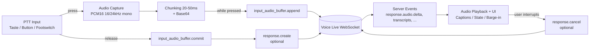

# Deep Research: GitHub-Projekte mit Microsoft Voice Live API + Push-to-Talk

## Executive Summary

Es **gibt** mehrere GitHub-Repositories, die die (Microsoft/Azure) **Voice Live API** mit einer **Push-to-Talk (PTT)**-Bedienlogik kombinieren. Am klarsten als „echtes PTT“ (gezieltes Senden von Mikrofon-Audio nur während des Tastendrucks/Buttons) sind: (a) **TakahiroMiyaura/VoiceLiveAPISamples** (C#/.NET; PTT via Tastaturkommando „R“ Start/Stop Recording) citeturn21view0turn23view1turn22view0 und (b) **GiriD/speech-to-speech-voice-live-app** (Python/Tkinter; Push-to-Talk per UI-Button, der Audio nur beim Gedrückthalten sendet) citeturn3view0turn9view0turn7view0. Zusätzlich existieren offizielle Microsoft/Azure-Samples mit **Start/Stop**, **Mute/Unmute** und **Pause/Resume**-Kontrollen (PTT-ähnlich als Software-Toggle), u. a. **Azure-Samples/call-center-voice-agent-accelerator** (Start Talking / Stop Conversation) citeturn24view0turn25view2turn27view0 und **Azure-Samples/voicelive-webapp** (Mute/Unmute, Pause/Resume, Start/End Call) citeturn35view0turn37view0turn38view0.

Technisch passt Voice Live sehr gut zu PTT, weil Audio über WebSocket-Events in einen **Input-Audiopuffer** gestreamt wird (`input_audio_buffer.append`) und am Ende des PTT-Turns explizit **committed** werden kann (`input_audio_buffer.commit`). citeturn46view0turn45view0

## Hintergrund: Was ist die Microsoft Voice Live API und wie „PTT“ dazu passt

Die **Voice Live API** ist eine **WebSocket-basierte, bidirektionale Echtzeit-API** für Sprachinteraktionen (ASR + generative Antwort + TTS; optional Avatar/WebRTC), deren Event-Modell weitgehend mit der Azure OpenAI Realtime API kompatibel ist. citeturn45view0turn46view0  
Wesentliche Punkte für eine PTT-Implementierung:

Der **WebSocket-Endpunkt** wird in der Microsoft-Dokumentation u. a. als `wss://<resource>.services.ai.azure.com/voice-live/realtime?api-version=2025-10-01` (oder für ältere Ressourcen `...cognitiveservices.azure.com/...`) beschrieben; das Modell wird typischerweise über Query-Parameter (`model=...`) angegeben. citeturn45view0

Zur **Authentifizierung** unterstützt die Voice Live API (i) **Microsoft Entra ID (Bearer Token)** und (ii) **API-Key** (als Header oder – insbesondere im Browser – als Query-Parameter). citeturn45view0

Für PTT wichtig: Das Event-Modell sieht u. a. `input_audio_buffer.append` (Base64-Audio), `input_audio_buffer.commit` (Turn-Ende/Verarbeitung) und `response.create` (Antwort anstoßen) vor. citeturn46view0  
Damit kann man PTT sauber als „Audio nur während Gedrückthalten senden“ (Append) + „auf Release committen“ (Commit) modellieren.

## Vergleich der relevantesten GitHub-Repositories

| Repository | Primärsprache | Letzter Commit | Lizenz | Voice-Live-API-Nachweis | PTT-Support (Art & Nachweis) | Demo/Usage/Build (Kurz) | Aktivität/Signal |
|---|---:|---:|---:|---|---|---|---|
| **TakahiroMiyaura/VoiceLiveAPISamples**<br>`https://github.com/TakahiroMiyaura/VoiceLiveAPISamples` | C# (100%) citeturn23view0 | 21.02.2026 citeturn22view0 | BSL-1.0 citeturn21view0turn23view0 | README: „Azure AI Foundry … Voice Live API“ + nutzt offiziell **Azure.AI.VoiceLive** NuGet citeturn21view0turn23view1 | **PTT via Tastatur**: „Press ‘R’ to start/stop recording“ (inkl. Auto-Stop am Speech-Ende) citeturn21view0turn23view1 | `dotnet build ...` / `dotnet run ...` (zwei Apps: Custom WS + SDK) citeturn21view0 | 0 Issues/PRs, aber sehr frische Commits (starkes Wartungssignal trotz kleiner Community) citeturn21view0turn22view0 |
| **GiriD/speech-to-speech-voice-live-app**<br>`https://github.com/GiriD/speech-to-speech-voice-live-app` | Python (100%) citeturn3view0 | 06.11.2025 citeturn9view0 | keine Lizenzdatei ersichtlich (rechtlich „All rights reserved“, sofern nicht anders angegeben) citeturn3view0turn8view0 | README: „powered by Azure Voice Live API“ citeturn3view0 + Code importiert `azure.ai.voicelive` und nutzt `connection.input_audio_buffer.append(...)` citeturn7view0 | **PTT via UI-Button (Hold-to-talk)**: Audio wird nur gesendet, wenn `capture_enabled` aktiv ist; Methoden `enable_capture()` / `disable_capture()` citeturn7view0 | `uv sync` / `uv run main.py`; Windows/macOS/Linux Notes; Demo-Video-Datei im Repo citeturn3view0 | 0 Issues/PRs, 1 Commit (eher „Sample/PoC“) citeturn3view0turn9view0 |
| **Azure-Samples/voicelive-webapp**<br>`https://github.com/Azure-Samples/voicelive-webapp` | TypeScript (78.2%) citeturn37view0 | 05.11.2025 citeturn38view0 | README behauptet MIT („see LICENSE“) citeturn37view0 | README: „built using Azure Voice Live API and WebRTC“ citeturn35view0 | **PTT-ähnlich via UI-Toggles**: „Mute/Unmute“, „Pause/Resume“, „Start/End call“ citeturn35view0turn37view0 | Backend: `pip install -r requirements.txt`, `python main.py`; Frontend: `npm install`, `npm run dev` citeturn35view0 | 0 Issues, 1 PR; kleiner offizieller Sample, seit 2025-11 keine neuen Commits citeturn35view0turn38view0 |
| **Azure-Samples/call-center-voice-agent-accelerator**<br>`https://github.com/Azure-Samples/call-center-voice-agent-accelerator` | Bicep (59.1%), Python (32.6%) citeturn26view0 | 23.01.2026 citeturn27view0 | MIT citeturn24view0turn26view0 | README: „uses Azure Voice Live API and Azure Communication Services“ citeturn24view0 | **PTT-ähnlich via Web-UI**: „Click Start Talking…“ / „Click Stop Conversation…“ citeturn25view2 | Deployment-first: `azd init ...` / `azd up`; Test-Webclient per Browser citeturn24view0turn25view1 | 3 Issues / 8 PRs; 59 Forks (breite Nutzung + aktive Pflege) citeturn24view0turn27view0 |
| **havared/azure-voice-live-agent**<br>`https://github.com/havared/azure-voice-live-agent` | Python (100%) citeturn41view0 | 09.02.2026 citeturn40view0 | keine Lizenzangabe im Repo-Header sichtbar citeturn36view0turn39view0 | README: Bridge „browser/mobile clients to Azure Voice Live“; detaillierte Session-/Relay-Beschreibung citeturn41view1 | **Session-Start per Button**: Browser-Testclient: „click Start Session“; PTT müsste in Client ergänzt werden (Gating) citeturn41view1 | `pip install -r requirements.txt`, `python -m app.main`; WebSocket-Protokoll dokumentiert citeturn41view1 | 3 Commits, 0 Issues/PRs (kleines, aber aktuelles Bridge-Projekt) citeturn36view0turn40view0 |
| **microsoft-foundry/voicelive-samples** (offiziell)<br>`https://github.com/microsoft-foundry/voicelive-samples` | TypeScript (46.9%), Python (20.2%), C# (14.9%)… citeturn10view0 | 21.02.2026 citeturn42view0 | MIT citeturn10view0turn42view0 | README: Multi-Language Voice Live Samples + Verweis auf offizielle Doku citeturn10view0 | **Indirekt/teilweise**: Commit-Log erwähnt „mute/unmute in frontend“ (Hinweis auf Mic-Gating im Sample-Frontend) citeturn42view0 | Setup über language folders; mehrere Quickstarts + „Voice Live Universal Assistant“ citeturn10view0turn42view0 | 1 Issue / 2 PRs + frische Commits (starkes offizielles Wartungssignal) citeturn10view0turn42view0turn34search7 |

## Evidenz-Highlights pro Repository

**TakahiroMiyaura/VoiceLiveAPISamples (C#/.NET, Konsolen-PTT via Tastatur)**  
Kurzer README-Auszug als PTT-Beleg:  
> “Press 'R' to start/stop recording …” citeturn23view1  
Das Projekt ist besonders wertvoll, weil es sowohl eine **Custom-WebSocket-Implementierung** als auch eine Variante mit dem **offiziellen Azure.AI.VoiceLive SDK** beschreibt. citeturn21view0turn23view1

**GiriD/speech-to-speech-voice-live-app (Python GUI, „Hold-to-talk“)**  
Kurzer README-Auszug:  
> “… powered by Azure Voice Live API … using push-to-talk controls.” citeturn3view0  
Code-Evidenz (PTT-Gating + VoiceLive SDK): Der Code importiert `azure.ai.voicelive...connect` und sendet Audio nur, wenn `capture_enabled` gesetzt ist, indem er `connection.input_audio_buffer.append(...)` nutzt. citeturn7view0

**Azure-Samples/voicelive-webapp (Web, Mute/Pause/Start-End Call)**  
Kurzer README-Auszug (PTT-nahe Controls):  
> “Interactive controls (mute, pause, captions toggle)” citeturn35view0  
Und explizit:  
> “Mute/Unmute audio … Pause/Resume … Start/End call” citeturn37view0  
Das ist nicht zwingend „Hold-to-talk“, aber praktisch ein **Software-PTT/Mic-Gating**.

**Azure-Samples/call-center-voice-agent-accelerator (offiziell, Browser-Testclient Start/Stop)**  
PTT-ähnlicher Ablauf ist im README als Testschritte beschrieben:  
> “Click Start Talking to Agent … Click Stop Conversation …” citeturn25view2  
Das Projekt ist eher ein **Solution Accelerator** (inkl. Telephony via ACS) als ein minimalistisches PTT-Snippet. citeturn24view0

**havared/azure-voice-live-agent (Bridge + Browser-Testclient)**  
Kurzer README-Auszug (Bedienung):  
> “click Start Session … allow microphone access, and speak.” citeturn41view1  
Stark ist hier die **klare Architektur-Beschreibung** (Relay-Loops, Token-Minting, Session.update). citeturn41view1 Ein echtes „PTT-Hold“ ist nicht explizit dokumentiert, lässt sich aber sehr gut im Browser-Testclient ergänzen.

**microsoft-foundry/voicelive-samples (offiziell, breites Sample-Set)**  
Kurzer Beleg für ein Mic-Gating-ähnliches Feature im Frontend (aus Commit-Historie):  
> “mute/unmute in frontend” citeturn42view0  
Als offizielle Sammlung ist es der beste Startpunkt für „saubere“ Implementierungen, aber man muss sich das passende Subsample herausziehen. citeturn10view0turn42view0

## Wie man PTT sauber mit der Voice Live API umsetzt

### Anforderungen aus offizieller Doku (Endpunkte, Auth, Events)

**Endpunkt & Modelwahl:** Microsoft dokumentiert den Voice-Live-WebSocket-Endpunkt im Format `wss://<resource>.services.ai.azure.com/voice-live/realtime?api-version=2025-10-01` (oder `...cognitiveservices...` bei älteren Ressourcen) und beschreibt, dass Modelle über Query-Parameter (z. B. `model=...`) bzw. bei Agent-Use-Cases zusätzlich `agent_id`/`project_id` gewählt werden. citeturn45view0

**Auth:**  
Microsoft Entra ID wird als bevorzugt genannt (Bearer-Token im `Authorization` Header). Alternativ kann ein API-Key verwendet werden; im Browser ist laut Doku der `api-key` Header für den Prehandshake nicht verfügbar, daher ist die Query-Parameter-Variante relevant. citeturn45view0

**Für PTT entscheidende Events:** Die API-Referenz listet die Kern-Events u. a. `input_audio_buffer.append`, `input_audio_buffer.commit`, `input_audio_buffer.clear` sowie `response.create` und `response.cancel`. citeturn46view0

### Praktische PTT-Logik (Hold-to-talk und Toggle)

**Hold-to-talk (klassisches PTT, empfohlen):**  
Während Taste/Button gedrückt ist: Audio kontinuierlich capturen und in kurzen Chunks (z. B. 20–50 ms) als Base64 per `input_audio_buffer.append` streamen. Beim Loslassen: `input_audio_buffer.commit` senden, optional direkt danach `response.create`, damit der Server antwortet. Das Event-Modell ist dafür explizit vorgesehen. citeturn46view0  
Dieses Muster sieht man in sehr ähnlicher Form in **GiriD/speech-to-speech-voice-live-app**, wo das Senden an `connection.input_audio_buffer.append(...)` nur bei aktivem „capture_enabled“ erfolgt. citeturn7view0

**Toggle-PTT (Start/Stop/Mute):**  
Ein UI-Schalter „Mic an/aus“ kann schlicht die `append`-Events stoppen/starten. Offizielle Samples nutzen dieses UX-Muster häufig (Start/Stop Conversation; Mute/Unmute). citeturn25view2turn37view0

### Mermaid-Flowchart: PTT-Integration mit Voice Live



### Kurzer, code-naher Implementierungsplan

Ein robustes PTT-Design (plattformunabhängig) lässt sich so planen:

Erstens Session-Aufbau: WebSocket verbinden, dann als erstes `session.update` senden, um Audioformat, Turn-Detection/VAD und Voice zu konfigurieren. Microsoft beschreibt `session.update` als typisches erstes Event. citeturn45view0turn46view0

Zweitens Audio-Pipeline: Mikrofon auf **PCM16 mono** konfigurieren (typisch 24 kHz, weil viele Samples das so nutzen; auch Microsoft nennt PCM16 und Sampling-Raten als Feature). citeturn46view0turn45view0

Drittens PTT-Zustandsautomat:  
Wenn `PTT_DOWN`: Audio-Chunks senden (`append`).  
Wenn `PTT_UP`: `commit` senden, ggf. `response.create`. (Bei serverseitiger Turn-Detection kann man `response.create` manchmal auch weglassen; aber die API-Referenz sieht es explizit vor.) citeturn46view0

Viertens UX/Fehlerfälle: „Barge-in“ (User spricht während Agent-Audio) kann per `response.cancel` bzw. Playback-Queue-Reset behandelt werden; mehrere Samples erwähnen Barge-in/Turn-Detection als Fokus. citeturn46view0turn10view0

## Suchqueries und Next Steps

### Queries, die auf GitHub erfahrungsgemäß die besten Treffer liefern

In GitHub-Suche (Repos + Code) funktionieren Kombinationen aus API-Event-Namen und PTT-Begriffen oft besser als nur „PTT“:

```text
"azure.ai.voicelive" push-to-talk
"input_audio_buffer.append" (push-to-talk OR mute OR unmute OR hotkey OR keybind)
"input_audio_buffer.commit" push to talk
"voice-live/realtime" (push_to_talk OR "start talking" OR mute OR unmute)
site:github.com voicelive "Press 'R' to start/stop recording"
site:github.com voicelive "Mute/Unmute"
```

Für offizielle Quellen zusätzlich:

```text
site:github.com Azure-Samples voicelive (mute OR unmute OR "start talking")
site:github.com microsoft-foundry voicelive-samples mute unmute
```

### Empfohlene nächste Schritte für eine eigene Lösung

Wenn du sofort ein PTT-Referenzprojekt brauchst, ist **TakahiroMiyaura/VoiceLiveAPISamples** der beste „Blueprint“ für Desktop/Console (Tastatursteuerung, mehrere Modi, SDK + Custom WS). citeturn21view0turn22view0  
Für eine schnelle GUI, die „Hold-to-talk“ bereits implementiert, ist **GiriD/speech-to-speech-voice-live-app** ein guter Startpunkt (auch wenn Wartung/Community klein sind). citeturn3view0turn7view0  
Für Web-UX mit Mute/Pause/Start-End Call sind die offiziellen Samples **voicelive-webapp** und **call-center-voice-agent-accelerator** die pragmatischsten Basen. citeturn37view0turn25view2turn24view0

Für eine produktionsreife Umsetzung sollten Endpunkt- und Auth-Details (Entra vs API-Key; Browser-Einschränkungen; Scopes) direkt aus der Microsoft-Doku übernommen werden. citeturn45view0turn46view0